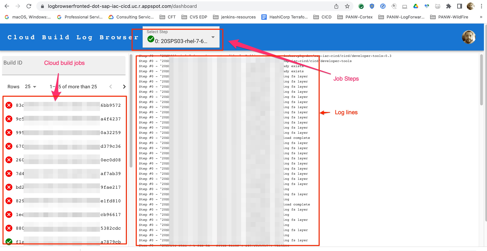
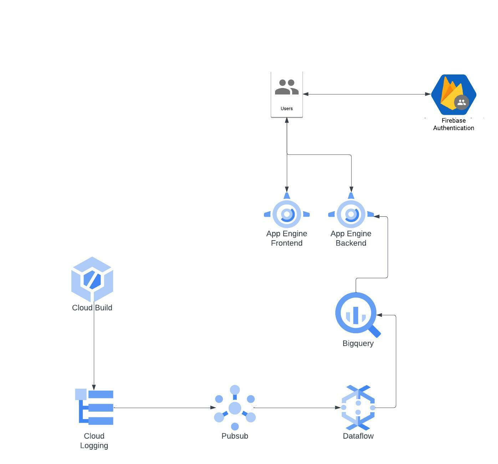

# Cloud Build Log Browser

Cloud Build Log Browser is a web app that displays Cloud Build logs that are truncated in the default log viewer.
This application and supporting architecture allow you to see large Cloud Build Logs per job and per step.


## Problem Statement

Cloud Build can not display logs of build jobs that have more than 9000 lines of logs. The raw logs
can be viewed but without any formatting. This becomes an issue if you have multiple steps running in parallel that are
generating a lot of log lines. One good example would be ansible deployment of the SAP products on GCP.

One good example of a project that generates a log of log lines is [SAP Deployment Automation](https://github.com/GoogleCloudPlatform/sap-deployment-automation)

## Architecture

The code in this repo will create a log forwarder that will push cloud build logs into a Pub/Sub topic. A Dataflow
job will take the logs from the Pub/Sub, parse it, and then push it into the BigQuery. A user can view the logs via
the web app (Cloud Build Log Browser) that is deployed with AppEngine.


## Requirements

You will need:

1. A GCP project with a VPC and a subnet. Choose a project that is running the Cloud Build jobs
1. Firebase project
1. terraform installed
1. nodejs installed (v16.17.0 when this doc was written)

## 1. Deploy resources using terraform

In order to deploy the terraform resources your user or service account will need the following roles

- roles/iam.serviceAccountAdmin
- roles/resourcemanager.projectIamAdmin
- roles/bigquery.admin
- roles/logging.admin
- roles/pubsub.admin
- roles/dataflow.admin
- roles/storage.admin

1. clone this repo
1. cd [terraform](terraform)
1. cp terraform.tfvars.example terraform.tfvars
1. Set the variables in `terraform.tfvars`
1. terraform init
1. terraform apply

## 2. Start the Dataflow job

1. Get the gcloud command that will start the dataflow job by running `terraform -chdir=terraform/ output -raw dataflow_command`
1. Run the gcloud command from the above step.

Example:

```bash
gcloud dataflow jobs run transform-log-to-bq \
  --project my-awesome-project-01 \
  --gcs-location gs://dataflow-templates-us-central1/latest/PubSub_Subscription_to_BigQuery \
  --region us-central1 \
  --max-workers 3 \
  --num-workers 1 \
  --service-account-email dataflow-log-to-bq-sa@my-awesome-project-01.iam.gserviceaccount.com \
  --staging-location gs://my-awesome-project-01-dataflow-transform-log-to-bq/temp/ \
  --subnetwork https://www.googleapis.com/compute/v1/projects/my-awesome-project-01/regions/us-central1/subnetworks/dataflow \
  --network dataflow \
  --disable-public-ips \
  --worker-machine-type n1-standard-2 \
  --enable-streaming-engine \
  --additional-experiments enable_streaming_engine \
  --parameters inputSubscription=projects/my-awesome-project-01/subscriptions/cloud-build-log-sub,javascriptTextTransformGcsPath=gs://my-awesome-project-01-dataflow-transform-log-to-bq/main.js,javascriptTextTransformFunctionName=transform,outputTableSpec=my-awesome-project-01:cloud_build_logs.logs
```

## 3. Build the Cloud Build Log Browser web app frontend

This procedure will build the frontend

1. cp .env.local.example .env.local
1. Set the variables in the `.env.local`
   1. You can see how to setup the firbase in [Firebase_setup.md](docs/Firebase_setup.md)
   1. Value for the `REACT_APP_BACKEND_URL` should be `https://logbrowserfronted-dot-PROJECT_ID.uc.r.appspot.com` where `PROJECT_ID` is the value of the `project` variable in the [terraform.tfvars](terrraform)
1. npm install
1. npm run build

## 4. Deploy the Cloud Build Log Browser web app

In the following steps the PROJECT_ID should be the value of the `project` variable in [terraform.tfvars](terraform)

1. terraform -chdir=terraform/ output -raw backend_yaml > backend/backend.yaml
1. gcloud app deploy backend/backend.yaml --project PROJECT_ID
1. gcloud app deploy fronted.yaml --project PROJECT_ID
   gcloud app deploy backend/dispatch.yaml --project PROJECT_ID

## More Details

- Parsing of the logs in the Dataflow job is described in [main.js](terraform/files/main.js)
- User **authentication** is done using Firebase. The Firbase setup is described in [Firebase_setup.md](docs/Firebase_setup.md)
- Backend code that queries BQ data is in [main.py](backend/main.py)
- User **authorization** is done in [main.py](backend/main.py). Only users that have at least one of the roles described in the `ALLOWED_ROLES` global variable will be able to see the logs.

### Local Development

Frontend:

1. Run npm install
1. Set `REACT_APP_BACKEND_URL` in `.env.local` to `http://127.0.0.1:8080`
1. npm start

Backend:

1. Set the following environmental variables
   ```sh
   APP_LB_DEBUG=true
   GOOGLE_CLOUD_PROJECT=$(terraform -chdir=terraform/ output -raw project_id)
   DATASET_ID=$(terraform -chdir=terraform/ output -raw dataset_id)
   TABLE_ID=$(terraform -chdir=terraform/ output -raw table_id)
   ```
1. Create a virtual environment
1. pip install -r backend/requirements.txt
1. python backend/main.py
   1. This will start a flask app on http://127.0.0.1:8080
