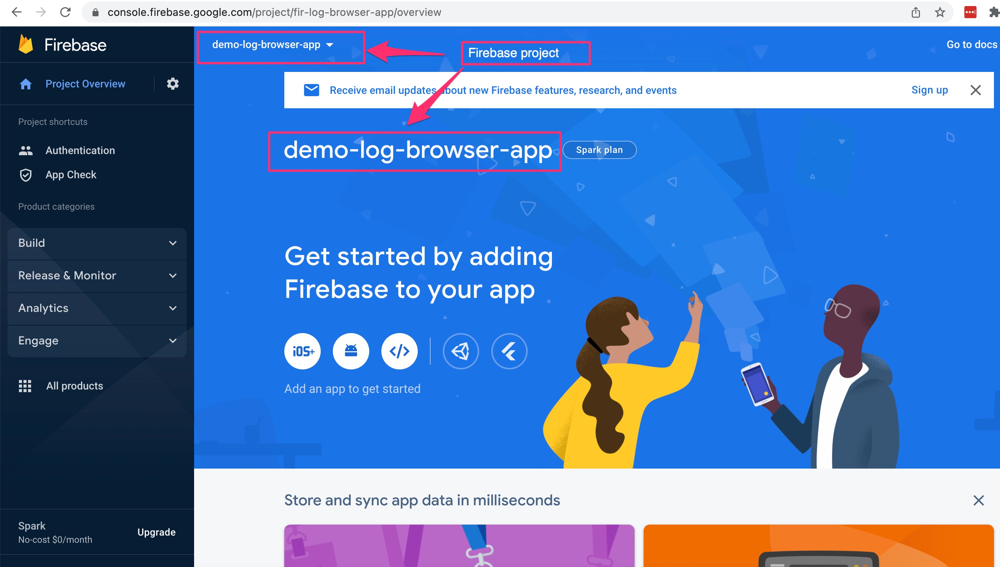
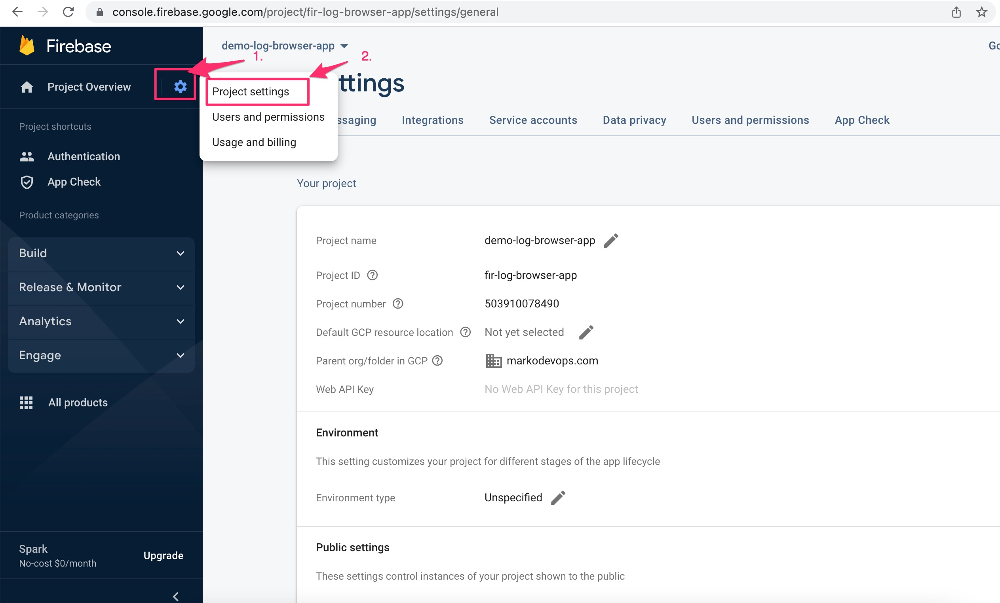
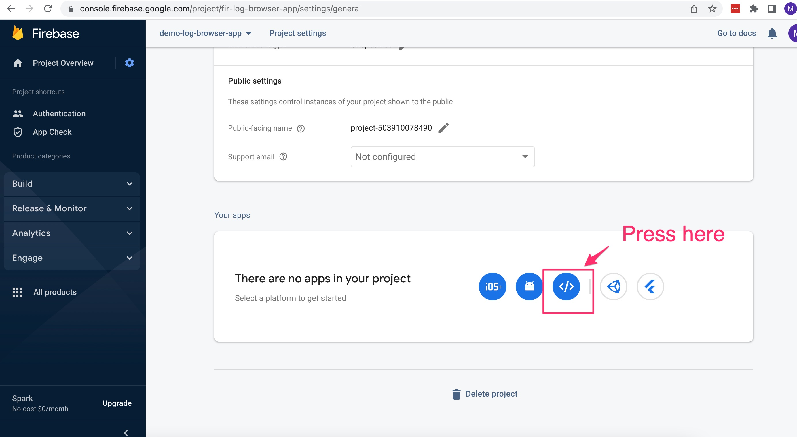
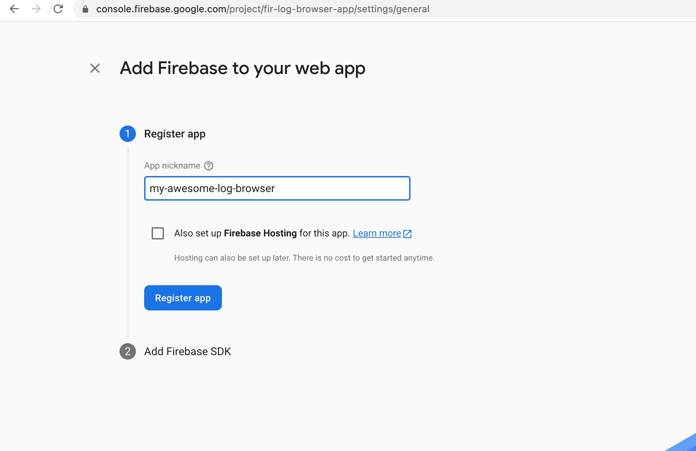
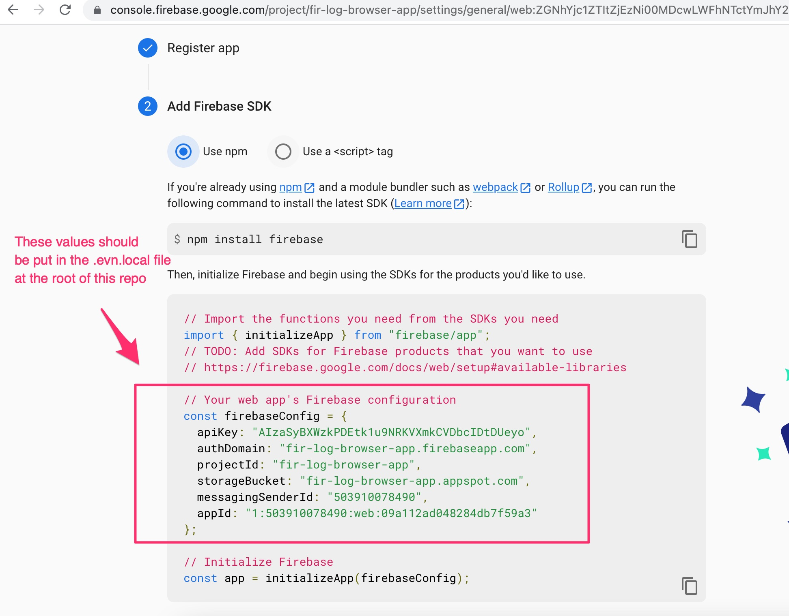
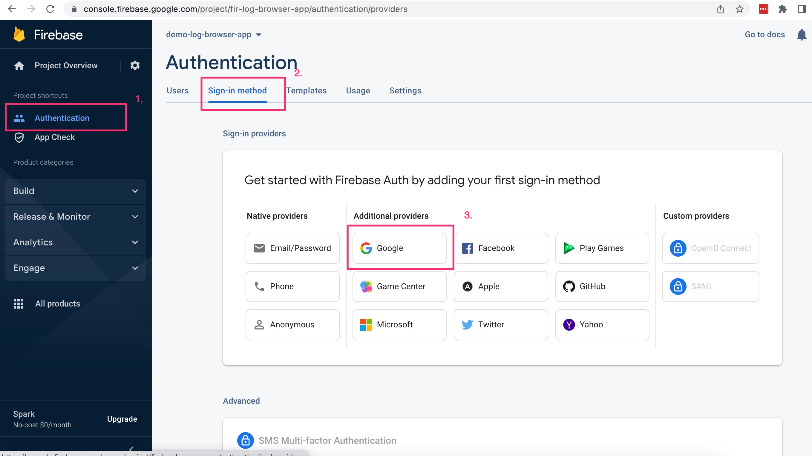
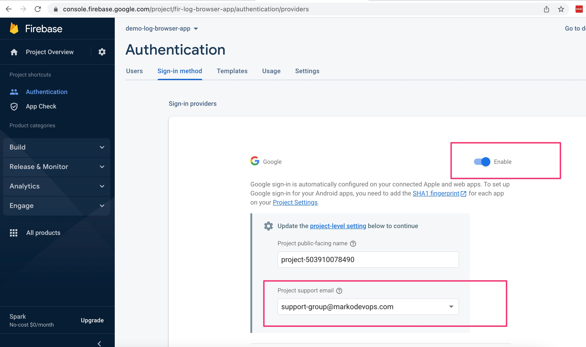
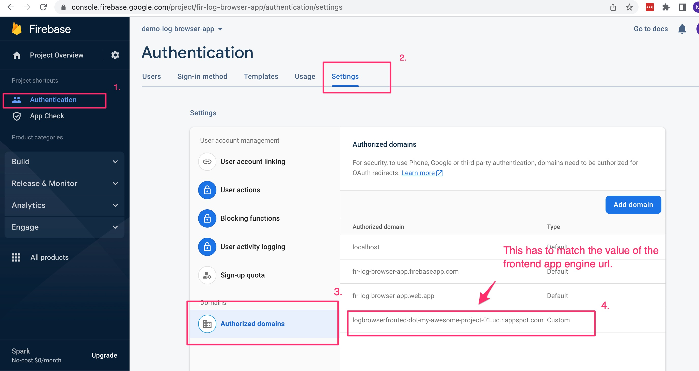

# Firebase setup

1. Go to https://console.firebase.google.com/
1. Create a project if you don't have one or go to the existing project. Example:
   
1. Go to Project Settings
   
1. Scroll down and create app
   
1. Name your app (For example: my-awesome-log-browser)
1. Press Register App
   
1. Populate values from `firebaseConfig` into `.env.local` file
   
1. Press Continue to console
1. On the left press on Authentication and choose Google in the Sign-in method
   
1. Enable the google provider by toggling Enable switch and set the Project support email
   
1. Press Save button
1. Go to `Authentication->Settings->Authorized domains` and add the appengine domain. The url will be `https:logbrowserfronted-dot-PROJECT_ID.uc.r.appspot.com` where `PROJECT_ID` is the value of `project` set in `terraform.tfvars` in [terraform](../terraform/) directory.
   
